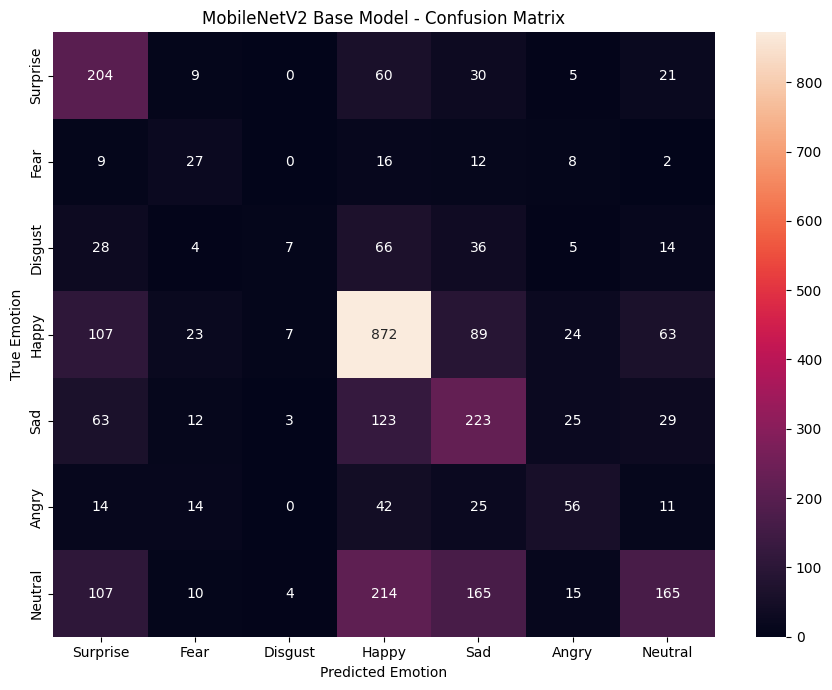
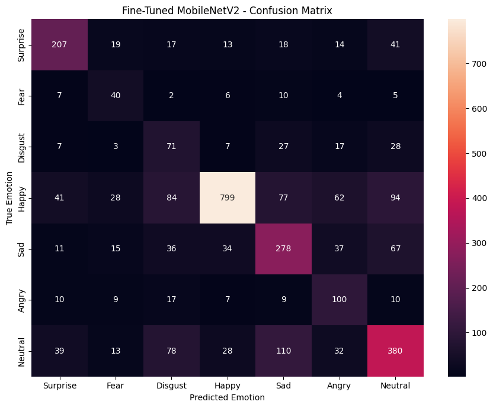
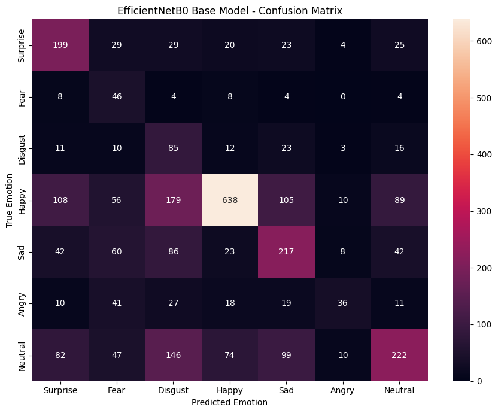
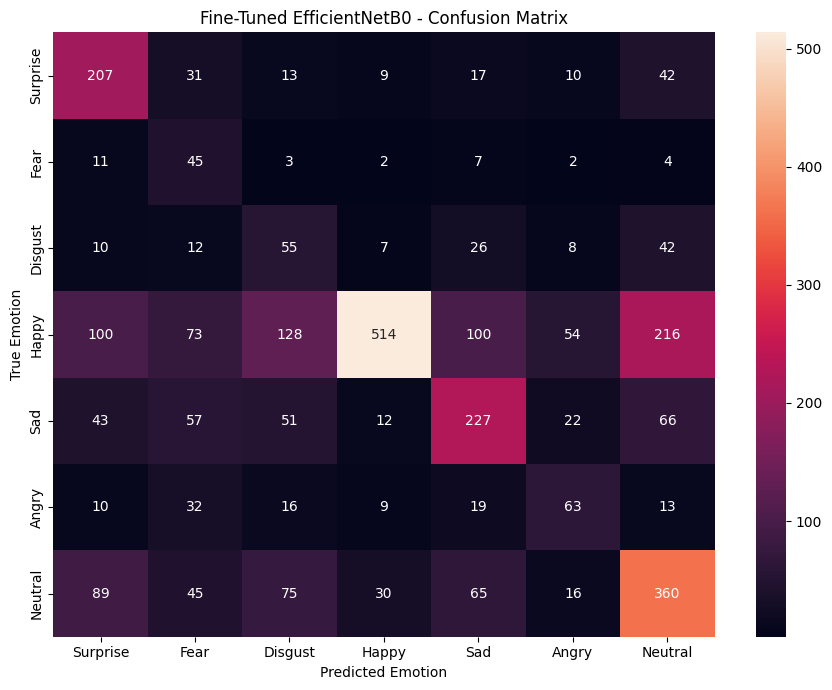

# Real-Time Video Emotion Detection

A deep learning project for detecting human emotions from real-time video.

The planned system combines **YOLO-based face detection** with a **CNN-based facial emotion classifier** to detect faces in video frames and classify their emotional state in real time.

> **Project Status: 🚧 In Progress**
>
> The current repository contains the completed **CNN-based facial emotion classification stage**. The YOLO-based face detection and real-time video integration stages are yet to be implemented.

---

## 📌 Project Overview

Facial expressions provide important visual cues about a person's emotional state. This project aims to develop a real-time system capable of detecting faces from a video stream and classifying the detected facial expressions into multiple emotion categories.

The final system is planned as a two-stage computer vision pipeline:

```text
                    Real-Time Video
                           │
                           ▼
                  ┌─────────────────┐
                  │  YOLO Face      │
                  │    Detection    │
                  └────────┬────────┘
                           │
                    Detected Face
                           │
                           ▼
                  ┌─────────────────┐
                  │ CNN Emotion     │
                  │ Classification │
                  └────────┬────────┘
                           │
                           ▼
                  ┌─────────────────┐
                  │ Emotion +       │
                  │ Confidence      │
                  └─────────────────┘
````

The current implementation focuses on the second stage:

> **Facial Image → CNN → Emotion Classification**

The YOLO-based face detection and real-time video pipeline will be added in later stages.

---

# 🎯 Project Objectives

The main objectives of the project are:

* Develop a multi-class facial emotion classification model.
* Compare different pretrained CNN architectures.
* Evaluate both frozen-backbone and fine-tuned models.
* Address class imbalance in the training data.
* Analyze model performance using accuracy, precision, recall and F1-score.
* Select the most suitable CNN model for the final real-time system.
* Integrate the selected classifier with a YOLO-based face detector.
* Process webcam/video frames in real time.
* Display detected faces, predicted emotions and confidence scores.

---

# 🧠 Planned Final Architecture

The final system will consist of the following stages.

## Stage 1 — Face Detection

YOLO will be used to locate human faces in each video frame.

```text
Video Frame
     │
     ▼
YOLO Face Detector
     │
     ├── Face 1
     ├── Face 2
     └── Face 3
```

## Stage 2 — Face Preprocessing

Each detected face will be cropped and preprocessed before being passed to the emotion classifier.

```text
Detected Face
      │
      ▼
Resize / Normalize
      │
      ▼
CNN Input
```

## Stage 3 — Emotion Classification

The selected CNN model will classify each detected face into one of seven emotion categories.

```text
Face Crop
   │
   ▼
MobileNetV2 / Selected CNN
   │
   ▼
Softmax
   │
   ├── Surprise
   ├── Fear
   ├── Disgust
   ├── Happy
   ├── Sad
   ├── Angry
   └── Neutral
```

## Stage 4 — Real-Time Visualization

The final system will display the detected face, predicted emotion and confidence directly on the video frame.

```text
┌──────────────────────────────────────────┐
│                                          │
│        ┌───────────────────┐             │
│        │                   │             │
│        │      FACE         │             │
│        │                   │             │
│        └───────────────────┘             │
│          Happy - 87.4%                   │
│                                          │
└──────────────────────────────────────────┘
```

---

# 📂 Dataset

## RAF-DB — Real-world Affective Faces Database

The current CNN classification stage uses the **Real-world Affective Faces Database (RAF-DB)**.

RAF-DB contains facial images with emotion annotations and includes significant variation in:

* Age
* Gender
* Ethnicity
* Head pose
* Lighting conditions
* Facial occlusions
* Facial hair
* Glasses
* Image quality
* Image processing effects

The dataset used in this project contains approximately **15,000 images**.

### Emotion Classes

The current classification task uses seven basic emotion classes:

| Label | Emotion  |
| ----: | -------- |
|     1 | Surprise |
|     2 | Fear     |
|     3 | Disgust  |
|     4 | Happy    |
|     5 | Sad      |
|     6 | Angry    |
|     7 | Neutral  |

The CSV annotation files contain the image filename and corresponding numerical label.

Example:

```text
image                  label
train_00001_aligned.jpg    5
train_00002_aligned.jpg    5
train_00003_aligned.jpg    4
```

---

## ⚠️ Dataset License

RAF-DB is provided for **non-commercial research purposes**.

The dataset images are **not included in this repository**.

Users should obtain the dataset through an appropriate authorized source and comply with the original RAF-DB terms and conditions.

---

# 🗂️ Dataset Structure

The dataset used during development follows this structure:

```text
RAF-DB DATASET/
│
└── DATASET/
    │
    ├── train/
    │   ├── train_00001_aligned.jpg
    │   ├── train_00002_aligned.jpg
    │   ├── train_00003_aligned.jpg
    │   └── ...
    │
    ├── test/
    │   ├── test_0001_aligned.jpg
    │   ├── test_0002_aligned.jpg
    │   └── ...
    │
    ├── train_labels.csv
    │
    └── test_labels.csv
```

The CSV files contain:

```text
image
label
```

The actual images are stored separately inside the `train` and `test` directories.

---

# 🧪 Current Development Stage

The project is currently at the **CNN emotion classification stage**.

Two pretrained CNN architectures have been investigated:

* MobileNetV2
* EfficientNetB0

For each architecture, two experiments were performed:

1. Base pretrained model with frozen feature extractor
2. Fine-tuned model with selected pretrained layers unfrozen

This resulted in four evaluated models:

```text
MobileNetV2
├── Base
└── Fine-Tuned

EfficientNetB0
├── Base
└── Fine-Tuned
```

---

# 🔄 CNN Training Workflow

The current workflow is:

```text
RAF-DB
   │
   ▼
Load train/test CSV files
   │
   ▼
Construct image paths
   │
   ▼
Analyze class distribution
   │
   ▼
Class balancing / oversampling
   │
   ▼
Image augmentation
   │
   ▼
Training / Validation split
   │
   ├───────────────────────┐
   ▼                       ▼
MobileNetV2             EfficientNetB0
   │                       │
   ├── Base                ├── Base
   │                       │
   └── Fine-Tuned          └── Fine-Tuned
   │                       │
   └──────────┬────────────┘
              ▼
       Model Evaluation
              │
              ▼
 Accuracy / Precision /
 Recall / F1 / Confusion Matrix
              │
              ▼
       Model Comparison
              │
              ▼
       Best CNN Model
```

---

# ⚖️ Class Imbalance

RAF-DB has a significant class imbalance.

For example, the test set contains:

| Emotion  | Test Samples |
| -------- | -----------: |
| Surprise |          329 |
| Fear     |           74 |
| Disgust  |          160 |
| Happy    |         1185 |
| Sad      |          478 |
| Angry    |          162 |
| Neutral  |          680 |

The large difference between classes can cause a model to favor dominant classes such as **Happy** while performing poorly on minority classes such as **Fear** and **Disgust**.

Therefore, the training pipeline includes class balancing / oversampling of minority classes.

The original test distribution is retained for evaluation so that model performance can be measured on the real test distribution.

---

# 🏗️ Models

## 1. MobileNetV2

MobileNetV2 was selected because it provides a good balance between:

* Classification performance
* Model size
* Computational requirements
* Inference speed

This makes it particularly relevant to the eventual real-time video application.

Two experiments were performed.

### Base MobileNetV2

The ImageNet-pretrained feature extractor was frozen and a new classification head was trained.

```text
Image
  │
  ▼
MobileNetV2
Frozen Backbone
  │
  ▼
Global Average Pooling
  │
  ▼
Dropout
  │
  ▼
Dense Layer
  │
  ▼
7 Emotion Classes
```

### Fine-Tuned MobileNetV2

Selected deeper layers of MobileNetV2 were unfrozen and trained with a smaller learning rate.

The purpose was to adapt the ImageNet features to the facial emotion classification task.

---

# 2. EfficientNetB0

EfficientNetB0 was evaluated as an alternative CNN architecture.

The same two-stage strategy was followed:

```text
EfficientNetB0
│
├── Base Model
│
└── Fine-Tuned Model
```

EfficientNetB0 provides efficient feature extraction and was included to determine whether it could outperform MobileNetV2 for this particular dataset.

---

# 📊 Experimental Results

The four models were evaluated on the RAF-DB test set.

The primary model-selection metric is **Macro F1-score**, because the dataset is class-imbalanced.

Accuracy is also reported, but accuracy alone can hide poor performance on minority classes.

---

## MobileNetV2 Base Model

```text
Test Loss     : 1.3386
Test Accuracy : 0.5065
```

| Emotion  | Precision | Recall | F1-score |
| -------- | --------: | -----: | -------: |
| Surprise |    0.3835 | 0.6201 |   0.4739 |
| Fear     |    0.2727 | 0.3649 |   0.3121 |
| Disgust  |    0.3333 | 0.0437 |   0.0773 |
| Happy    |    0.6260 | 0.7359 |   0.6765 |
| Sad      |    0.3845 | 0.4665 |   0.4216 |
| Angry    |    0.4058 | 0.3457 |   0.3733 |
| Neutral  |    0.5410 | 0.2426 |   0.3350 |

```text
Accuracy       : 0.5065
Macro F1       : 0.3814
Weighted F1    : 0.4833
```

---

## MobileNetV2 Fine-Tuned

```text
Test Loss     : 1.0722
Test Accuracy : 0.6111
```

| Emotion  | Precision | Recall | F1-score |
| -------- | --------: | -----: | -------: |
| Surprise |    0.6429 | 0.6292 |   0.6359 |
| Fear     |    0.3150 | 0.5405 |   0.3980 |
| Disgust  |    0.2328 | 0.4437 |   0.3054 |
| Happy    |    0.8937 | 0.6743 |   0.7686 |
| Sad      |    0.5255 | 0.5816 |   0.5521 |
| Angry    |    0.3759 | 0.6173 |   0.4673 |
| Neutral  |    0.6080 | 0.5588 |   0.5824 |

```text
Accuracy       : 0.6111
Macro F1       : 0.5300
Weighted F1    : 0.6304
```

### Improvement from Fine-Tuning

Compared with the MobileNetV2 base model:

```text
Accuracy:
0.5065 → 0.6111

Macro F1:
0.3814 → 0.5300

Test Loss:
1.3386 → 1.0722
```

Fine-tuning substantially improved the overall classification performance and improved the balance of performance across emotion classes.

---

# EfficientNetB0 Base Model

```text
Test Loss     : 1.4243
Test Accuracy : 0.4703
```

| Emotion  | Precision | Recall | F1-score |
| -------- | --------: | -----: | -------: |
| Surprise |    0.4326 | 0.6049 |   0.5044 |
| Fear     |    0.1592 | 0.6216 |   0.2534 |
| Disgust  |    0.1529 | 0.5312 |   0.2374 |
| Happy    |    0.8045 | 0.5384 |   0.6451 |
| Sad      |    0.4429 | 0.4540 |   0.4483 |
| Angry    |    0.5070 | 0.2222 |   0.3090 |
| Neutral  |    0.5428 | 0.3265 |   0.4077 |

```text
Accuracy       : 0.4703
Macro F1       : 0.4008
Weighted F1    : 0.4983
```

---

# EfficientNetB0 Fine-Tuned

```text
Test Loss     : 1.4594
Test Accuracy : 0.4795
```

| Emotion  | Precision | Recall | F1-score |
| -------- | --------: | -----: | -------: |
| Surprise |    0.4404 | 0.6292 |   0.5181 |
| Fear     |    0.1525 | 0.6081 |   0.2439 |
| Disgust  |    0.1613 | 0.3438 |   0.2196 |
| Happy    |    0.8816 | 0.4338 |   0.5814 |
| Sad      |    0.4924 | 0.4749 |   0.4835 |
| Angry    |    0.3600 | 0.3889 |   0.3739 |
| Neutral  |    0.4845 | 0.5294 |   0.5060 |

```text
Accuracy       : 0.4795
Macro F1       : 0.4181
Weighted F1    : 0.5047
```

---

# 🏆 Model Comparison

| Model                      | Test Accuracy |   Macro F1 |  Test Loss |
| -------------------------- | ------------: | ---------: | ---------: |
| **MobileNetV2 Fine-Tuned** |    **0.6111** | **0.5300** | **1.0722** |
| EfficientNetB0 Fine-Tuned  |        0.4795 |     0.4181 |     1.4594 |
| EfficientNetB0 Base        |        0.4703 |     0.4008 |     1.4243 |
| MobileNetV2 Base           |        0.5065 |     0.3814 |     1.3386 |

---

# 🥇 Current Best Model

Based on the current experiments:

```text
BEST MODEL:
MobileNetV2 Fine-Tuned

Selection Criterion:
Highest Macro F1
```

The fine-tuned MobileNetV2 achieved:

```text
Accuracy : 61.11%
Macro F1 : 53.00%
Loss     : 1.0722
```

Therefore, **MobileNetV2 Fine-Tuned is currently selected as the CNN emotion classifier for the next stage of the project.**

---

# 📈 Training Curves

Training and validation accuracy/loss curves were generated for all four experiments.

The curves are used to analyze:

* Learning progression
* Convergence
* Overfitting
* Underfitting
* Training/validation gaps
* Effect of fine-tuning

The complete curves are available in the `cnn_model.ipynb` notebook and results folder.

---

# 📊 Confusion Matrix Analysis

Confusion matrices were generated for all four models.

They provide class-level information that cannot be observed from accuracy alone.

The current results show that:

* **Happy** is generally the easiest class to recognize.
* **Fear** and **Disgust** remain challenging.
* Several emotions are confused with Happy, Sad and Neutral.
* Fine-tuned MobileNetV2 substantially improves several minority-class recalls.
* EfficientNetB0 does not outperform MobileNetV2 under the current training configuration.

A major remaining challenge is separating visually similar facial expressions.

---

# 🔍 Current Findings

## 1. Fine-Tuning Is Important

MobileNetV2 improved significantly after fine-tuning:

```text
Base Accuracy       → 50.65%
Fine-Tuned Accuracy → 61.11%

Base Macro F1       → 38.14%
Fine-Tuned Macro F1 → 53.00%
```

This indicates that adapting the pretrained features to RAF-DB is beneficial.

---

## 2. Accuracy Alone Is Misleading

The dataset is highly imbalanced, with Happy representing a much larger portion of the test set than Fear or Disgust.

Therefore, a model could obtain reasonable accuracy while performing poorly on minority emotions.

For this reason, **Macro F1 is currently used as the primary comparison metric**.

---

## 3. MobileNetV2 Currently Outperforms EfficientNetB0

Under the current training pipeline:

```text
MobileNetV2 Fine-Tuned
Macro F1 = 0.5300

EfficientNetB0 Fine-Tuned
Macro F1 = 0.4181
```

MobileNetV2 therefore provides the strongest current classification performance.

It is also an attractive candidate for the eventual real-time application because of its lightweight architecture.

---

## 4. The Problem Is Not Solved Yet

A 61.11% test accuracy and 0.53 Macro F1 are useful intermediate results, but they are **not considered the final performance target** for this project.

In particular, Disgust remains difficult:

```text
Fine-Tuned MobileNetV2

Disgust Recall = 0.4437
Disgust F1     = 0.3054
```

Further improvement is required before deploying the classifier in a real-time system.

---

# 🚧 Remaining Work

The current repository represents an intermediate milestone rather than the completed project.

## Phase 1 — CNN Emotion Classification

* [x] Load RAF-DB
* [x] Build image-label mapping
* [x] Analyze class distribution
* [x] Handle training class imbalance
* [x] Image preprocessing
* [x] Data augmentation
* [x] Train MobileNetV2 base model
* [x] Fine-tune MobileNetV2
* [x] Train EfficientNetB0 base model
* [x] Fine-tune EfficientNetB0
* [x] Generate training/validation curves
* [x] Generate confusion matrices
* [x] Generate classification reports
* [x] Compare all four models
* [x] Select the current best model

---

## Phase 2 — Face Detection

**Status: ⏳ Not Started**

The next stage is to integrate a YOLO-based face detector.

Planned workflow:

```text
Video Frame
     │
     ▼
YOLO Face Detection
     │
     ▼
Face Bounding Boxes
     │
     ▼
Crop Individual Faces
```

---

## Phase 3 — CNN + YOLO Integration

**Status: ⏳ Pending**

The selected MobileNetV2 emotion classifier will be connected to the YOLO face detector.

```text
                 Video Frame
                      │
                      ▼
                YOLO Detector
                      │
             ┌────────┴────────┐
             ▼                 ▼
          Face 1             Face 2
             │                 │
             ▼                 ▼
       MobileNetV2       MobileNetV2
             │                 │
             ▼                 ▼
          Happy              Sad
```

---

## Phase 4 — Real-Time Video Pipeline

**Status: ⏳ Pending**

The final application will process webcam/video input frame-by-frame.

Planned features:

* Real-time face detection
* Multiple-face detection
* Emotion classification
* Confidence scores
* Bounding boxes
* Emotion labels
* FPS monitoring
* Webcam support
* Video-file support

---

## Phase 5 — Temporal Emotion Stabilization

**Status: ⏳ Planned**

Frame-by-frame predictions can fluctuate.

For example:

```text
Frame 1 → Happy
Frame 2 → Neutral
Frame 3 → Happy
Frame 4 → Sad
Frame 5 → Happy
```

The final system may use temporal smoothing or a short prediction history to produce more stable results:

```text
Recent predictions:
Happy
Happy
Neutral
Happy
Happy

        ↓

Final Prediction:
Happy
```

This is especially important for a practical real-time emotion detection system.

---

# 🛠️ Technology Stack

### Deep Learning

* TensorFlow
* Keras
* CNN
* Transfer Learning
* Fine-Tuning

### Computer Vision

* OpenCV
* YOLO
* Image preprocessing
* Real-time video processing

### Models

Current:

* MobileNetV2
* EfficientNetB0

Planned:

* YOLO-based face detector
* Fine-tuned MobileNetV2 emotion classifier

### Data Processing

* Python
* NumPy
* Pandas
* Scikit-learn

### Visualization

* Matplotlib
* Seaborn

---

# 📁 Repository Structure

The repository is currently organized around the CNN development stage.

Recommended structure:

```text
Real-Time-Video-Emotion-Detection/
│
├── README.md
│
├── notebooks/
│   └── cnn-model.ipynb
│
├── results/
│   ├── mobilenetv2_base_confusion_matrix.png
│   ├── mobilenetv2_finetuned_confusion_matrix.png
│   ├── efficientnetb0_base_confusion_matrix.png
│   ├── efficientnetb0_finetuned_confusion_matrix.png
│   └── training_curves/
│
├── models/
│   └── .gitkeep
│
├── src/
│   └── .gitkeep
│
└── requirements.txt
```

As development progresses, the repository can be expanded:

```text
src/
│
├── detection/
│   └── yolo_detector.py
│
├── classification/
│   └── emotion_classifier.py
│
├── preprocessing/
│   └── image_preprocessing.py
│
└── realtime/
    └── video_emotion_detection.py
```

---

# 📓 Current Notebook

The current experimental implementation is available in:

```text
notebooks/cnn-model.ipynb
```

The notebook contains:

* Dataset loading
* Image path construction
* Label processing
* Class distribution analysis
* Training data balancing
* Image preprocessing
* Data augmentation
* MobileNetV2 training
* MobileNetV2 fine-tuning
* EfficientNetB0 training
* EfficientNetB0 fine-tuning
* Model evaluation
* Classification reports
* Confusion matrices
* Training/validation curves
* Model comparison
* Random image prediction

---

# 📸 Results

Selected model evaluation results are included in the `assets/` directory.

### MobileNetV2 Base



### MobileNetV2 Fine-Tuned



### EfficientNetB0 Base



### EfficientNetB0 Fine-Tuned



---

# 🚀 Future Improvements

The following improvements will be investigated in future iterations:

* [ ] YOLO-based face detection
* [ ] Real-time webcam emotion detection
* [ ] Multiple-face emotion detection
* [ ] Temporal prediction smoothing
* [ ] Better handling of minority classes
* [ ] Experiment with class-weighted loss
* [ ] Experiment with focal loss
* [ ] Improve Disgust and Fear classification
* [ ] Hyperparameter optimization
* [ ] Compare additional lightweight CNN architectures
* [ ] Evaluate real-time FPS
* [ ] Optimize inference latency
* [ ] Save and deploy the best trained model
* [ ] Build a simple user interface
* [ ] Complete end-to-end YOLO + CNN pipeline

---

# 🎯 Final Goal

The ultimate goal of this project is to build an end-to-end real-time facial emotion detection system:

```text
                    ┌─────────────────┐
                    │   Webcam /      │
                    │   Video Input   │
                    └────────┬────────┘
                             │
                             ▼
                    ┌─────────────────┐
                    │ YOLO Face       │
                    │ Detection       │
                    └────────┬────────┘
                             │
                       Face Crops
                             │
                             ▼
                    ┌─────────────────┐
                    │ Fine-Tuned      │
                    │ MobileNetV2     │
                    └────────┬────────┘
                             │
                             ▼
                  ┌──────────────────────┐
                  │ Emotion Prediction   │
                  │ + Confidence Score   │
                  └──────────┬───────────┘
                             │
                             ▼
                    ┌─────────────────┐
                    │ Real-Time       │
                    │ Visualization   │
                    └─────────────────┘
```

The current CNN experiments establish the **emotion classification component** of this pipeline.

The next major milestone is integrating the selected **MobileNetV2 classifier with YOLO-based face detection** to create the complete real-time video system.

---

# 📌 Current Status

```text
CNN Emotion Classification      ████████████████████  Completed
Model Comparison                ████████████████████  Completed
Best Model Selection            ████████████████████  Completed

YOLO Face Detection             ░░░░░░░░░░░░░░░░░░░░  Pending
YOLO + CNN Integration          ░░░░░░░░░░░░░░░░░░░░  Pending
Real-Time Video Processing      ░░░░░░░░░░░░░░░░░░░░  Pending
Temporal Smoothing              ░░░░░░░░░░░░░░░░░░░░  Pending
Deployment                      ░░░░░░░░░░░░░░░░░░░░  Pending
```

> This repository is actively under development. The current results represent the CNN classification milestone of the larger real-time video emotion detection project.

```
```
