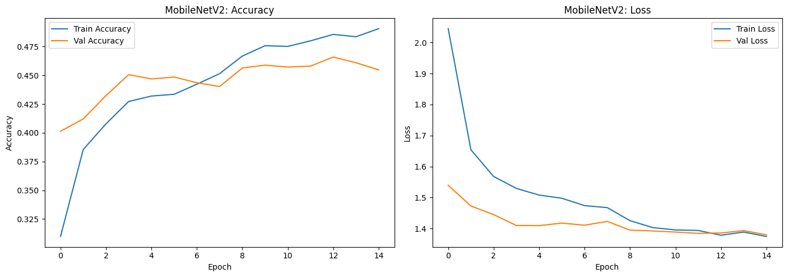
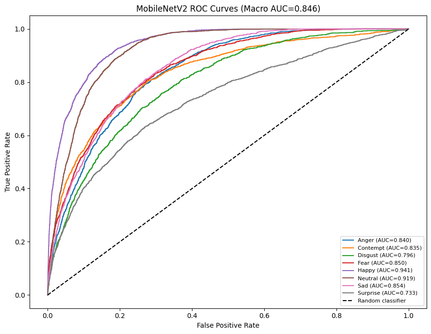
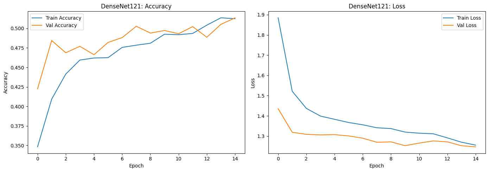
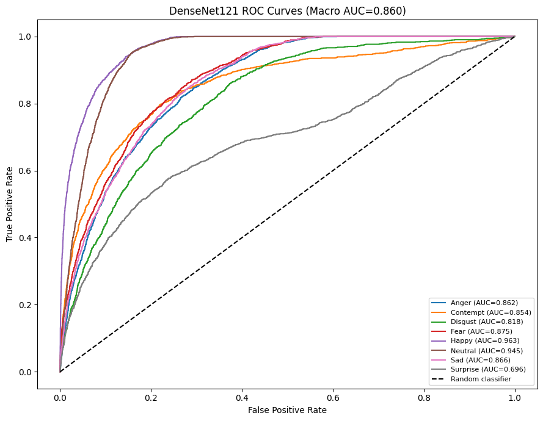
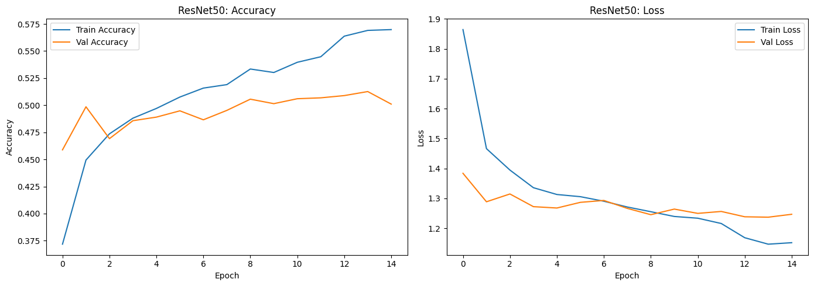
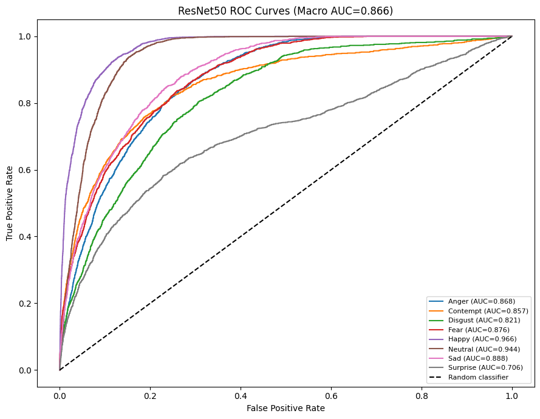
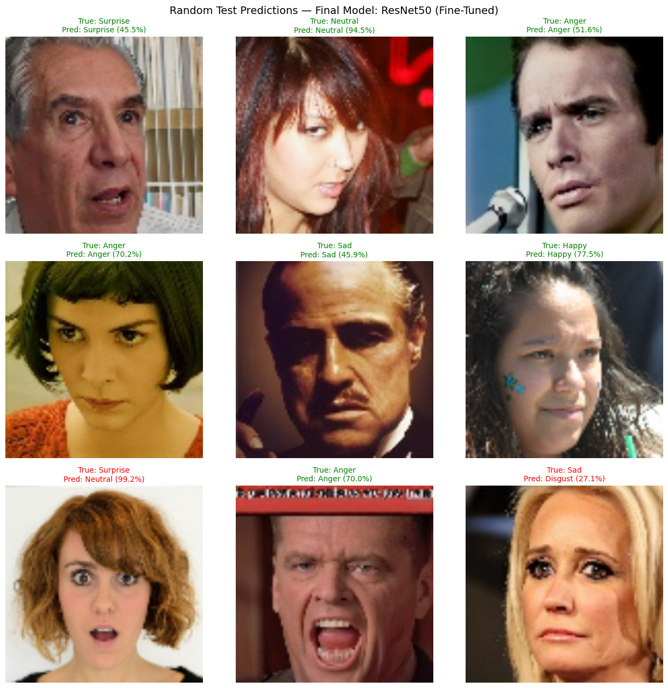

# Real-Time Video-Based Facial Emotion Detection

A deep learning system for **real-time facial emotion detection from video and webcam streams**, combining YOLO-based face detection with CNN-based emotion classification.

The system consists of two separate computer vision stages:

1. **YOLO face detection** — detects and localizes human faces in each frame.
2. **CNN emotion classification** — classifies each detected face into one of eight emotion categories.

The face detector was trained using **WIDER FACE**, while the emotion classifier was trained using an **AffectNet-derived dataset** and evaluated with three transfer-learning CNN architectures:

- MobileNetV2
- DenseNet121
- ResNet50

After comparing the baseline models, ResNet50 was selected for fine-tuning. The resulting fine-tuned ResNet50 is used as the final emotion-classification model.

---

## Demo


---

## Project Overview

The complete inference pipeline is:

```text
Input Video / Webcam
        |
        v
YOLO Face Detector
        |
        v
Face Bounding Boxes
        |
        v
Face Cropping
        |
        v
Image Preprocessing
        |
        v
Fine-Tuned ResNet50
        |
        v
Emotion + Confidence
        |
        v
Annotated Output
````

For every detected face, the system:

* detects the face using YOLO,
* extracts the corresponding face region,
* resizes the face to `224 × 224`,
* passes it to the trained ResNet50 classifier,
* predicts one of eight emotion classes,
* calculates the prediction confidence,
* displays the bounding box, predicted emotion and confidence.

The YOLO detector is responsible **only for face detection**. It does not perform emotion classification.

---

## Key Features

* Real-time webcam facial emotion detection
* YOLO-based face detection
* WIDER FACE-based face detector
* AffectNet-derived emotion classification
* Eight-class facial emotion classification
* Transfer learning with MobileNetV2, DenseNet121 and ResNet50
* Class-weighted training for class imbalance
* Light image augmentation
* Model comparison using multiple evaluation metrics
* ResNet50 fine-tuning
* Classification reports
* Confusion matrix analysis
* Multiclass ROC-AUC analysis
* Per-class ROC-AUC evaluation
* Random test-image predictions
* Threaded webcam and inference pipeline
* Real-time FPS monitoring
* Separate face detection and emotion classification stages

---

## Emotion Classes

The emotion classifier predicts eight classes:

| Class Index | Emotion  |
| ----------: | -------- |
|           0 | Anger    |
|           1 | Contempt |
|           2 | Disgust  |
|           3 | Fear     |
|           4 | Happy    |
|           5 | Neutral  |
|           6 | Sad      |
|           7 | Surprise |

The same class ordering is used during training, evaluation and inference.

```python
CLASS_NAMES = [
    "Anger",
    "Contempt",
    "Disgust",
    "Fear",
    "Happy",
    "Neutral",
    "Sad",
    "Surprise"
]
```

---

## Dataset

### Emotion Classification Dataset

The emotion-classification component uses an **AffectNet-derived dataset** organized into class-specific folders.

Labels are read directly from the folder names. The `labels.csv` file included with the dataset is not used by the training pipeline.

```text
Dataset/
├── Train/
│   ├── anger/
│   ├── contempt/
│   ├── disgust/
│   ├── fear/
│   ├── happy/
│   ├── neutral/
│   ├── sad/
│   └── surprise/
│
└── Test/
    ├── Anger/
    ├── Contempt/
    ├── disgust/
    ├── fear/
    ├── happy/
    ├── neutral/
    ├── sad/
    └── surprise/
```

Folder-name capitalization is normalized during dataset loading.

### Dataset Distribution

The dataset used in this experiment contains the following image counts.

#### Training Set

| Emotion   |     Images |
| --------- | ---------: |
| Anger     |      1,500 |
| Contempt  |      1,559 |
| Disgust   |      1,229 |
| Fear      |      1,512 |
| Happy     |      2,340 |
| Neutral   |      2,758 |
| Sad       |      3,091 |
| Surprise  |      2,119 |
| **Total** | **16,108** |

#### Test Set

| Emotion   |     Images |
| --------- | ---------: |
| Anger     |      1,718 |
| Contempt  |      1,312 |
| Disgust   |      1,248 |
| Fear      |      1,664 |
| Happy     |      2,704 |
| Neutral   |      2,368 |
| Sad       |      1,584 |
| Surprise  |      1,920 |
| **Total** | **14,518** |

The original training set was split into **85% training and 15% validation** using a stratified split.

```text
Original Training Data
        |
        +----------------------+
        |                      |
        v                      v
    Training              Validation
       85%                    15%

Original Test Data
        |
        v
Independent Test Evaluation
```

The validation set was used during training for callbacks such as early stopping, learning-rate scheduling and checkpointing.

The test set was used for the reported model evaluation and comparison.

---

## Data Preprocessing

All CNN models use:

```text
Image Size: 224 × 224
Channels: 3
Batch Size: 32
```

The preprocessing pipeline is:

```text
Input Image
     |
     v
Image Loading
     |
     v
Resize to 224 × 224
     |
     v
Float32 Conversion
     |
     v
Training Augmentation
     |
     v
Model-Specific Preprocessing
     |
     v
CNN Backbone
```

Light augmentation is applied during training:

* Horizontal flipping
* Random rotation
* Random zoom
* Random contrast

The augmentation configuration uses:

```text
RandomRotation: 0.05
RandomZoom:     0.10
RandomContrast: 0.10
```

Augmentation is enabled during training and disabled during evaluation and inference.

---

## Class Imbalance Handling

The training data is not perfectly balanced across the eight emotion classes.

Class weights were calculated from the training distribution and supplied during model training.

| Emotion  | Class Weight |
| -------- | -----------: |
| Anger    |        1.342 |
| Contempt |        1.292 |
| Disgust  |        1.638 |
| Fear     |        1.332 |
| Happy    |        0.860 |
| Neutral  |        0.730 |
| Sad      |        0.651 |
| Surprise |        0.950 |

Higher weights are assigned to classes with fewer training samples so that errors on those classes contribute more strongly to the training loss.

---

## Face Detection with YOLO

The face-detection component is independent of the emotion-classification model.

### Dataset

The YOLO face detector was trained using **WIDER FACE**.

The WIDER FACE annotations were converted into YOLO-compatible format.

The detector contains a single class:

```text
0 → face
```

Approximately **12,880 training images** were processed for the YOLO training workflow.

The YOLO model is used strictly for:

```text
Face Detection
      ↓
Bounding Boxes
      ↓
Face Cropping
```

It does **not** classify emotions.

The trained model is:

```text
yolo_face_detector_best.pt
```

---

## CNN Emotion Classification

Three transfer-learning CNN architectures were trained independently:

* MobileNetV2
* DenseNet121
* ResNet50

All three use ImageNet-pretrained backbones.

The general classification architecture is:

```text
Input Image
     |
     v
224 × 224 × 3
     |
     v
Training Augmentation
     |
     v
Model-Specific Preprocessing
     |
     v
ImageNet Pretrained CNN Backbone
     |
     v
Global Average Pooling
     |
     v
Batch Normalization
     |
     v
Dropout (0.35)
     |
     v
Dense Layer (256, ReLU)
     |
     v
Batch Normalization
     |
     v
Dropout (0.30)
     |
     v
Softmax
     |
     v
8 Emotion Classes
```

The CNN backbones were initially frozen for baseline training.

Each model was trained independently and evaluated using multiple metrics.

---

# Model Results

## MobileNetV2

MobileNetV2 was used as the lightweight baseline.

### Test Performance

```text
Test Loss:       1.3952
Test Accuracy:   49.32%
Macro Precision: 46.15%
Macro Recall:    46.30%
Macro F1:        45.61%
Weighted F1:     48.52%
Macro ROC-AUC:   0.8461
```

### Training Curves



### Confusion Matrix


### ROC-AUC



---

## DenseNet121

DenseNet121 was evaluated using the same classification framework.

### Test Performance

```text
Test Loss:       1.4617
Test Accuracy:   52.04%
Macro Precision: 49.25%
Macro Recall:    49.04%
Macro F1:        47.66%
Weighted F1:     50.94%
Macro ROC-AUC:   0.8598
```

### Training Curves



### Confusion Matrix


### ROC-AUC



---

## ResNet50

ResNet50 was evaluated as the third baseline architecture.

### Base Test Performance

```text
Test Loss:       1.3857
Test Accuracy:   53.80%
Macro Precision: 50.20%
Macro Recall:    50.30%
Macro F1:        49.73%
Weighted F1:     53.07%
Macro ROC-AUC:   0.8657
```

### Training Curves



### Confusion Matrix


### ROC-AUC



---

## Baseline Model Comparison

The three CNN architectures were compared using accuracy, macro precision, macro recall, macro F1, weighted F1 and macro ROC-AUC.

| Model        | Test Accuracy | Macro Precision | Macro Recall |   Macro F1 | Weighted F1 | Macro ROC-AUC |
| ------------ | ------------: | --------------: | -----------: | ---------: | ----------: | ------------: |
| MobileNetV2  |        49.32% |          46.15% |       46.30% |     45.61% |      48.52% |        0.8461 |
| DenseNet121  |        52.04% |          49.25% |       49.04% |     47.66% |      50.94% |        0.8598 |
| **ResNet50** |    **53.80%** |      **50.20%** |   **50.30%** | **49.73%** |  **53.07%** |    **0.8657** |

ResNet50 had the highest reported baseline values across the comparison metrics and was selected for fine-tuning.

---

# ResNet50 Fine-Tuning

After the baseline comparison, selected ResNet50 backbone layers were unfrozen for further training.

The fine-tuning setup used:

```text
Model:              ResNet50
Previously Frozen:  ImageNet-pretrained backbone
Fine-Tuning:        Selected backbone layers
Learning Rate:      1e-5
```

The fine-tuning process was:

```text
Base ResNet50
      |
      v
Unfreeze Selected Backbone Layers
      |
      v
Lower Learning Rate
      |
      v
Fine-Tuning
      |
      v
Validation Monitoring
      |
      v
Test Evaluation
```

The other two CNN architectures were not fine-tuned because the experiment focused on further improving the selected ResNet50 model.

---

# Fine-Tuned ResNet50 Results

The fine-tuned ResNet50 achieved:

```text
Test Loss:       1.2586
Test Accuracy:   62.07%
Macro Precision: 58.90%
Macro Recall:    58.70%
Macro F1:        58.30%
Weighted F1:     61.30%
```

### Base vs Fine-Tuned ResNet50

| Metric          | Base ResNet50 | Fine-Tuned ResNet50 |
| --------------- | ------------: | ------------------: |
| Test Loss       |        1.3857 |          **1.2586** |
| Test Accuracy   |        53.80% |          **62.07%** |
| Macro Precision |        0.5020 |          **0.5890** |
| Macro Recall    |        0.5030 |          **0.5870** |
| Macro F1        |        0.4973 |          **0.5830** |
| Weighted F1     |        0.5307 |          **0.6130** |

### Accuracy Improvement

```text
53.80% → 62.07%
```

### Macro F1 Improvement

```text
0.4973 → 0.5830
```

The fine-tuned ResNet50 is used as the final emotion-classification model.

---

## Fine-Tuned ResNet50 Classification Report

| Emotion              | Precision |    Recall |  F1-score |
| -------------------- | --------: | --------: | --------: |
| Anger                |     0.582 |     0.430 |     0.495 |
| Contempt             |     0.572 |     0.595 |     0.583 |
| Disgust              |     0.403 |     0.514 |     0.452 |
| Fear                 |     0.596 |     0.419 |     0.492 |
| Happy                |     0.808 |     0.923 |     0.861 |
| Neutral              |     0.732 |     0.830 |     0.778 |
| Sad                  |     0.582 |     0.569 |     0.575 |
| Surprise             |     0.441 |     0.412 |     0.426 |
| **Accuracy**         |           |           | **0.621** |
| **Macro Average**    | **0.589** | **0.587** | **0.583** |
| **Weighted Average** | **0.615** | **0.621** | **0.613** |

The highest F1-scores in the final classification report are observed for **Happy** and **Neutral**. Disgust, Fear and Surprise remain more challenging classes.

---

## Fine-Tuned ResNet50 ROC-AUC

The final model's per-class ROC-AUC values are:

| Emotion  | ROC-AUC |
| -------- | ------: |
| Anger    |   0.903 |
| Contempt |   0.897 |
| Disgust  |   0.870 |
| Fear     |   0.902 |
| Happy    |   0.987 |
| Neutral  |   0.965 |
| Sad      |   0.924 |
| Surprise |   0.743 |

The ROC-AUC values are highest for **Happy** and **Neutral**, while **Surprise** has the lowest ROC-AUC among the eight classes.

---

# Final Model

The final emotion-classification model is:

```text
Fine-Tuned ResNet50
```

The complete system combines:

```text
YOLO Face Detector
        +
Fine-Tuned ResNet50
        +
AffectNet-Derived Emotion Classification
        =
Real-Time Facial Emotion Detection
```

### Final Pipeline

```text
Webcam / Video
       |
       v
YOLO Face Detector
       |
       v
Face Bounding Boxes
       |
       v
Face Cropping
       |
       v
224 × 224 Preprocessing
       |
       v
Fine-Tuned ResNet50
       |
       v
8-Class Prediction
       |
       v
Emotion + Confidence
       |
       v
Annotated Output
```

### Final Test Performance

| Metric          | Final ResNet50 |
| --------------- | -------------: |
| Test Loss       |     **1.2586** |
| Test Accuracy   |     **62.07%** |
| Macro Precision |      **0.589** |
| Macro Recall    |      **0.587** |
| Macro F1        |      **0.583** |
| Weighted F1     |      **0.613** |

---

# Random Test Predictions

The notebook also performs random predictions using images from the test set.

Each prediction displays:

* input face image,
* actual emotion,
* predicted emotion,
* prediction confidence.



These predictions provide a qualitative check of the final model's behavior on individual test samples.

---

# Real-Time Webcam Detection

A standalone Python script is provided for real-time webcam inference:

```text
src/webcam_detection.py
```

The webcam pipeline is:

```text
Webcam
   |
   v
Live Frame
   |
   v
YOLO Face Detection
   |
   v
Face Crop
   |
   v
Fine-Tuned ResNet50
   |
   v
Emotion + Confidence
   |
   v
Live Display
```

The webcam application displays:

* detected face bounding boxes,
* predicted emotion,
* emotion confidence,
* real-time FPS.

The camera acquisition and model inference are handled using a threaded pipeline so that webcam frame capture does not unnecessarily wait for model inference.

---

# Inference Preprocessing

The final Keras emotion-classification model contains the model-specific preprocessing layer used during training.

Therefore, the webcam application does not apply ResNet50 preprocessing a second time.

The inference flow is:

```text
Detected Face
      |
      v
BGR → RGB
      |
      v
Resize to 224 × 224
      |
      v
Float32 Conversion
      |
      v
Fine-Tuned ResNet50
      |
      v
Embedded Preprocessing
      |
      v
Emotion Prediction
```

This keeps the preprocessing behavior consistent between training and inference and avoids double preprocessing.

---

# Project Structure

```text
real-time-emotion-detection/
│
├── notebooks/
│   ├── AffectNet_Emotion_Classification.ipynb
│   └── YOLO_Face_Detection.ipynb
│
├── src/
│   └── webcam_detection.py
│
├── results/
│   ├── CNN/
│   │   ├── MobileNetV2_training_curves.png
│   │   ├── MobileNetV2_confusion_matrix.png
│   │   ├── MobileNetV2_roc_auc.png
│   │   ├── DenseNet121_training_curves.png
│   │   ├── DenseNet121_confusion_matrix.png
│   │   ├── DenseNet121_roc_auc.png
│   │   ├── ResNet50_training_curves.png
│   │   ├── ResNet50_confusion_matrix.png
│   │   ├── ResNet50_roc_auc.png
│   │   └── final_random_predictions.png
│   │
│   ├── integration/
│   │   ├── emotion_detection.png
│   │   └── emotion_detection_output.mp4
│   │
│   └── demo.gif
│
├── requirements.txt
├── .gitignore
└── README.md
```

Large trained model files and datasets should not be committed directly to the repository unless they are managed through an appropriate large-file mechanism.

---

# Technologies Used

### Programming

* Python

### Deep Learning

* TensorFlow
* Keras
* Ultralytics YOLO

### Computer Vision

* OpenCV

### Data Processing

* NumPy
* Pandas

### Machine Learning

* Scikit-learn

### Visualization

* Matplotlib
* Seaborn

### Development and Experimentation

* Google Colab
* Jupyter Notebook
* VS Code

---

# Installation

Clone the repository and install the required dependencies:

```bash
pip install -r requirements.txt
```

For local webcam inference, the system requires:

* a working webcam,
* compatible OpenCV installation,
* TensorFlow,
* Ultralytics,
* the trained emotion-classification model,
* the trained YOLO face-detection model.

---

# Running the CNN Notebook

The CNN notebook contains the complete emotion-classification workflow.

```text
1. Mount Google Drive
2. Load AffectNet-derived dataset
3. Read labels from class folders
4. Analyze class distribution
5. Split training data into training and validation sets
6. Apply preprocessing
7. Apply training augmentation
8. Calculate class weights
9. Build MobileNetV2
10. Train MobileNetV2
11. Evaluate MobileNetV2
12. Build DenseNet121
13. Train DenseNet121
14. Evaluate DenseNet121
15. Build ResNet50
16. Train ResNet50
17. Evaluate ResNet50
18. Compare the three baseline models
19. Select ResNet50 for fine-tuning
20. Fine-tune selected ResNet50 layers
21. Evaluate the fine-tuned model
22. Compare base and fine-tuned performance
23. Save the final model
24. Generate random test predictions
```

The final emotion model is saved as:

```text
best_emotion_model.keras
```

---

# Running the Webcam Application

After obtaining the trained models, update the model paths in:

```text
src/webcam_detection.py
```

Example:

```python
CNN_MODEL_PATH = r"C:\path\to\best_emotion_model.keras"
YOLO_MODEL_PATH = r"C:\path\to\yolo_face_detector_best.pt"
```

Then run:

```bash
python src/webcam_detection.py
```

The application performs:

```text
Face Detection
      ↓
Face Cropping
      ↓
Emotion Classification
      ↓
Confidence Display
      ↓
Real-Time FPS
```

Press:

```text
Q
```

or:

```text
ESC
```

to stop the application.

---

# Limitations

Facial emotion recognition remains a challenging computer vision problem.

The current system can be affected by:

* lighting conditions,
* head pose,
* facial occlusion,
* face size,
* image quality,
* camera quality,
* ambiguous facial expressions,
* similarities between emotion categories,
* differences between dataset images and real-world webcam images.

Performance also varies across emotion classes, so the overall accuracy should not be interpreted as universal real-world emotion recognition accuracy.

The reported metrics describe performance on the test dataset used in this experiment.

Facial expressions are observable visual patterns and should not be treated as definitive measurements of a person's internal emotional state.

---

# Future Improvements

Potential improvements include:

* improved handling of difficult emotion classes,
* targeted analysis of Disgust, Fear and Surprise,
* face alignment before emotion classification,
* temporal smoothing across consecutive frames,
* face tracking,
* prediction stabilization,
* confidence thresholding,
* uncertainty estimation,
* real-time inference optimization,
* GPU-optimized deployment,
* model quantization,
* ONNX-based deployment,
* evaluation on additional facial-expression datasets,
* improved domain generalization between controlled datasets and real-world webcam images.

---

# Conclusion

This project combines a **YOLO-based face detector** with a **fine-tuned ResNet50 emotion classifier** to create an end-to-end facial emotion detection pipeline.

The project includes:

* WIDER FACE-based face detection,
* AffectNet-derived emotion classification,
* class-imbalance handling,
* transfer learning,
* comparison of three CNN architectures,
* ResNet50 fine-tuning,
* multiclass evaluation,
* confusion matrix and ROC-AUC analysis,
* and real-time webcam inference.

The reported test accuracy improved from **53.80% with the frozen-backbone ResNet50 to 62.07% after fine-tuning**, while Macro F1 improved from **0.4973 to 0.5830**.

The final system uses:

```text
YOLO Face Detector
        +
Fine-Tuned ResNet50
        +
8-Class Emotion Classification
        =
Real-Time Facial Emotion Detection
```
