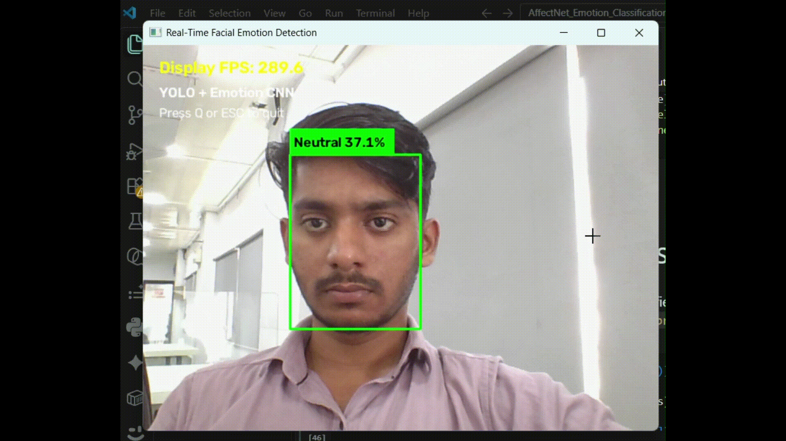
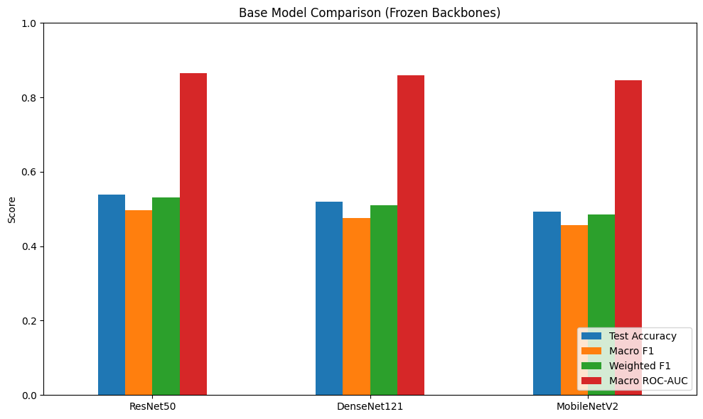
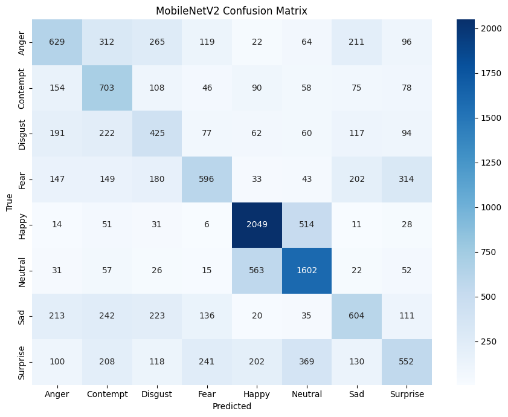
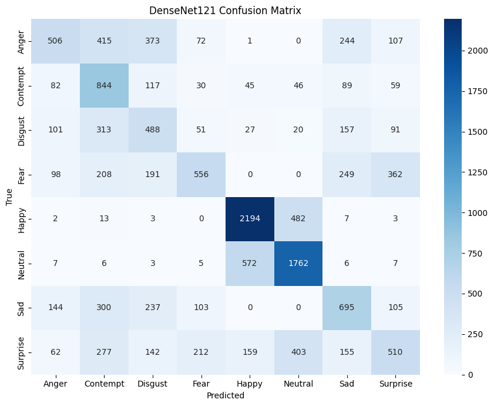
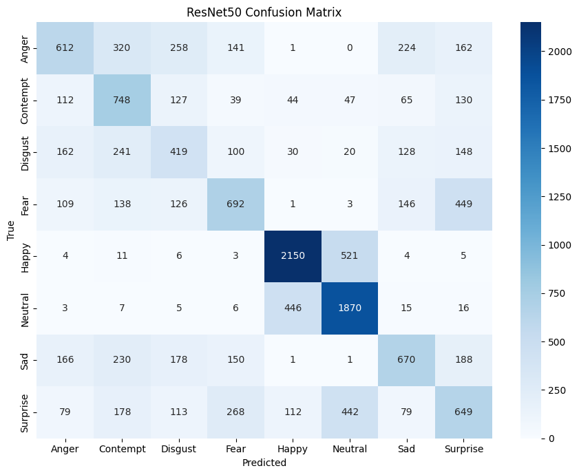

# Real-Time Facial Emotion Detection

<p align="center">
  
  
  
  
  
  
  
</p>

A real-time facial emotion detection system that combines YOLO-based face detection with a deep learning emotion classification model.

The system captures live webcam frames, detects human faces using YOLO, crops each detected face, and classifies the facial expression into one of seven emotion categories using a fine-tuned ResNet50 model.

---

## Demo



---

## Project Overview

This project implements a two-stage computer vision pipeline:

Webcam
↓
YOLO Face Detection
↓
Face Crop
↓
224 × 224 Resize
↓
ResNet50 Emotion Classifier
↓
Emotion + Confidence
↓
Real-Time Display

The system supports real-time detection from a webcam and displays the predicted emotion and confidence score for each detected face.

---

## Features

- Real-time webcam-based emotion detection
- YOLO-based face detection
- Deep learning-based facial emotion classification
- Transfer learning using pretrained CNN architectures
- Comparison of MobileNetV2, DenseNet121 and ResNet50
- Seven-class emotion classification
- Confidence score for predictions
- Multi-face detection
- Threaded webcam and inference pipeline
- Real-time FPS monitoring

---

## Emotion Classes

The system recognizes seven basic emotions:

| Class | Emotion |
|---|---|
| 0 | Surprise |
| 1 | Fear |
| 2 | Disgust |
| 3 | Happy |
| 4 | Sad |
| 5 | Angry |
| 6 | Neutral |

---

# Model Architecture

The project consists of two major deep learning components.

## 1. YOLO Face Detector

YOLO is responsible for detecting faces in each webcam frame.

```text
Webcam Frame
     ↓
YOLO Face Detector
     ↓
Face Bounding Boxes
````

The trained YOLO model is used only for face localization.

The detected face regions are then passed to the emotion classification model.

---

## 2. Emotion Classification

Three CNN architectures were evaluated using transfer learning:

* MobileNetV2
* DenseNet121
* ResNet50

Each model uses ImageNet pretrained weights and is fine-tuned for the seven RAF-DB emotion classes.

### Model Comparison

| Model       | Test Accuracy |   Macro F1 | Weighted F1 |
| ----------- | ------------: | ---------: | ----------: |
| MobileNetV2 |        56.55% |     51.05% |      58.60% |
| DenseNet121 |        62.29% |     54.42% |      64.42% |
| ResNet50    |    **67.05%** | **58.86%** |  **68.53%** |

Based on the evaluation results, **ResNet50 was selected as the final emotion classification model**.

---

## ResNet50 Performance

### Classification Report

| Emotion  | Precision | Recall | F1-score |
| -------- | --------: | -----: | -------: |
| Surprise |    0.5995 | 0.7964 |   0.6841 |
| Fear     |    0.3150 | 0.5405 |   0.3980 |
| Disgust  |    0.3060 | 0.5125 |   0.3832 |
| Happy    |    0.9430 | 0.6844 |   0.7932 |
| Sad      |    0.6795 | 0.6297 |   0.6536 |
| Angry    |    0.4777 | 0.6605 |   0.5544 |
| Neutral  |    0.6403 | 0.6676 |   0.6537 |

**Test Accuracy:** 67.05%

**Macro F1-score:** 58.86%

**Weighted F1-score:** 68.53%

---

## ROC-AUC Performance

The one-vs-rest ROC-AUC scores for the three evaluated models were:

| Emotion  | MobileNetV2 | DenseNet121 |   ResNet50 |
| -------- | ----------: | ----------: | ---------: |
| Surprise |      0.9133 |      0.9453 | **0.9479** |
| Fear     |      0.8950 |      0.8882 | **0.8936** |
| Disgust  |      0.8207 |      0.8506 | **0.8792** |
| Happy    |      0.8991 |      0.9374 | **0.9496** |
| Sad      |      0.8727 |      0.9025 | **0.9303** |
| Angry    |      0.9068 |      0.9217 | **0.9278** |
| Neutral  |      0.8584 |      0.8915 | **0.9007** |

ResNet50 achieved the strongest overall classification performance among the evaluated architectures.

---

# Dataset

The emotion classification model was trained and evaluated using the RAF-DB dataset.

The dataset contains seven basic emotion categories:

* Surprise
* Fear
* Disgust
* Happy
* Sad
* Angry
* Neutral

The dataset was organized into class-specific directories.

```text
DATASET/
├── train/
│   ├── 1/
│   ├── 2/
│   ├── 3/
│   ├── 4/
│   ├── 5/
│   ├── 6/
│   └── 7/
│
└── test/
    ├── 1/
    ├── 2/
    ├── 3/
    ├── 4/
    ├── 5/
    ├── 6/
    └── 7/
```

---

# Training Approach

The emotion classification models were developed using transfer learning.

### Stage 1 — Frozen Backbone

The pretrained CNN backbone was initially frozen and only the classification head was trained.

### Stage 2 — Fine-Tuning

The later layers of the pretrained backbone were unfrozen and fine-tuned using a lower learning rate.

Batch normalization layers were kept frozen during fine-tuning to improve training stability.

Class weights were used to address the class imbalance present in the dataset.

---

# Preprocessing

Each detected face is resized to:

```text
224 × 224 × 3
```

The final ResNet50 model contains its corresponding preprocessing operation inside the trained Keras model.

Therefore, the inference pipeline does not apply a second preprocessing operation externally.

```text
Detected Face
     ↓
Resize 224 × 224
     ↓
ResNet50 Model
     ↓
ResNet50 Preprocessing
     ↓
Emotion Prediction
```

---

# Real-Time Pipeline

The final application uses a threaded architecture.

```text
                  Webcam
                    │
                    ▼
             Camera Thread
                    │
                    ▼
              Latest Frame
                    │
                    ▼
              YOLO Detector
                    │
                    ▼
              Face Detection
                    │
                    ▼
              Face Cropping
                    │
                    ▼
             ResNet50 Model
                    │
                    ▼
            Emotion Prediction
                    │
                    ▼
          Result / Confidence
                    │
                    ▼
             Live Display
```

The camera and inference operations are separated into different threads to prevent model inference from blocking webcam frame acquisition.

---

# Project Structure

```text
Real-Time-Emotion-Detection/
│
├── README.md
├── requirements.txt
├── .gitignore
│
├── src/
│   └── webcam_detection.py
│
├── notebooks/
│   ├── emotion-classification-cnn-model.ipynb
│   └── yolo-face-detection-model.ipynb
│
│
├── results/
│   ├── cnn/
│   └── yolo/
│   └── yolo/

```

---

# Installation

Clone the repository and install the required dependencies:

```bash
git clone https://github.com/Hari-jith/Real-Time-Emotion-Detection.git
cd Real-Time-Emotion-Detection
pip install -r requirements.txt
```

A Conda environment is recommended for local execution.

---

# Model Files

The trained model files are not included in the repository.

Place the trained models locally:

```text
models/
├── best_emotion_model.keras
└── yolo_face_detector_best.pt
```

Update the model paths in:

```text
src/webcam_detection.py
```

---

# Running the Application

After installing the dependencies and placing the trained models in the appropriate location:

```bash
python src/webcam_detection.py
```

The application opens the webcam and performs:

```text
Face Detection → Emotion Classification → Live Visualization
```

Press:

```text
Q
```

or

```text
ESC
```

to stop the application.

---

# Results

## CNN Training Results



## Confusion Matrices

### MobileNetV2



### DenseNet121



### ResNet50



---

# Technologies Used

* Python
* TensorFlow / Keras
* OpenCV
* Ultralytics YOLO
* NumPy
* Pandas
* Matplotlib
* Scikit-learn
* RAF-DB

---

# Limitations

The emotion classifier is subject to limitations associated with facial expression recognition, including:

* Class imbalance
* Similarity between certain facial expressions
* Variations in lighting
* Face orientation and pose
* Occlusion
* Image quality
* Individual differences in facial expressions

The reported performance is based on the RAF-DB test set and should not be interpreted as universal real-world emotion recognition accuracy.

---

# Future Improvements

Potential improvements include:

* Better handling of low-light conditions
* Face tracking between frames
* Temporal emotion modeling using video sequences
* Improved performance for minority emotion classes
* GPU-optimized inference
* Confidence threshold calibration
* Deployment as a desktop or web application

---

# License

This project is intended for educational and research purposes.

---

# Author

**Harijith M M**
